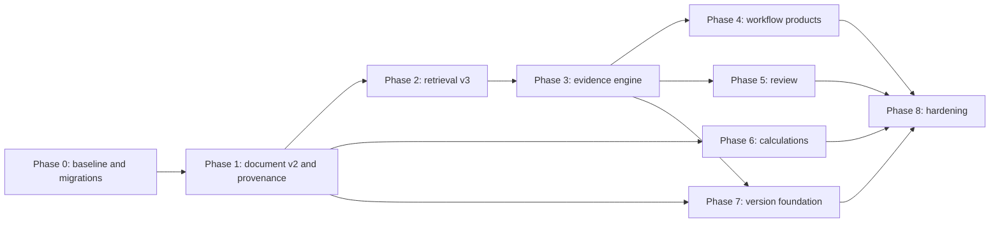

# Evidence Intelligence Implementation Plan

## Status and scope

- Status: implementation baseline delivered; release validation pending
- Target: one user or a small trusted team on a CPU-only 16 GB host
- Scope: workstreams 1, 2, 4, 5, 7, 8, 9, and 10 from the capability review
- Primary objective: make high-stakes document work more reliable without making a larger language model the default dependency
- Out of scope: enterprise tenancy, autonomous legal/clinical/financial decisions, internet-dependent production paths, distributed orchestration, and high-concurrency serving

The implementation should preserve CiteBot's fail-closed offline mode. Every new model must be provisioned ahead of runtime, pinned in `models/manifest.lock.json`, mounted read-only, and included in the 16 GB soak benchmark.

## Executive implementation decision

Build an evidence-first pipeline around the current LangGraph workflow:

1. Parse documents into stable, layout-aware elements with deterministic source anchors.
2. Retrieve cheap candidates using the existing dense and sparse paths.
3. Rerank only a bounded candidate set and expand selected chunks to their parent sections.
4. Generate a schema-constrained draft containing atomic claims and explicit evidence references.
5. Verify claims with deterministic checks plus a compact NLI verifier.
6. Refine or abstain when evidence is insufficient or contradictory.
7. Materialize the result as a versioned work product with provenance and review state.
8. Evaluate every layer independently: parsing, retrieval, claims, citations, calculations, diffs, resource usage, and reviewer outcomes.

This architecture follows the efficient pattern demonstrated by MiniCheck and the lightweight NLI provenance verifier: compact verification models can provide strong grounding checks without another large generation call. RefChecker's claim-triplet representation and VeriCite's generate-verify-select-refine pipeline inform the claim and citation flow. The design does not assume that correctness and citation faithfulness are equivalent; both must be measured separately.

## Current extension points

| Concern | Current implementation | Extension point |
| --- | --- | --- |
| Structured extraction | `DocumentElement`, `StructuredPage`, `StructuredDocument` in `app/ingestion/schemas.py` | Add stable anchors, tables, relationships, extraction quality, and parser adapters |
| Parsing | `LocalCorpusLoader` in `app/ingestion/loaders.py` | Introduce `BaseDocumentParser` and selectable native/Docling/PP-Structure adapters |
| Chunking | `SlidingWindowChunker` in `app/ingestion/chunker.py` | Add hierarchical chunks, parent links, serialized table chunks, and provenance hashes |
| Retrieval | `RetrievalService` in `app/retrieval/service.py` | Add query decomposition, bounded candidate pool, parent expansion, diversity, and calibrated abstention |
| Reranking | heuristic and sentence-transformers adapters in `app/retrieval/reranker.py` | Add bounded cross-encoder profile and optional Qdrant multi-stage profile |
| Generation graph | `ResearchAgentService` in `app/agents/service.py` | Add claim extraction, evidence selection, verification, refinement, work-product, and review nodes |
| Answer schema | `ResearchAnswer`, `Citation`, `ClaimVerification` in `app/agents/schemas.py` | Introduce atomic claims, anchors, deterministic checks, contradictions, and answer status |
| Citation checks | `CitationVerifier` in `app/tools/citation_verifier.py` | Split into claim extraction, evidence matcher, deterministic verifier, and NLI verifier |
| Calculation | opt-in `PythonSandboxTool` | Add a separate deterministic tabular engine; keep arbitrary Python outside trusted automated flows |
| Persistence | SQLAlchemy models in `app/db/models.py` | Add document versions, evidence runs, work products, reviews, calculations, and diffs |
| Evaluation | `EvaluationService` and local/RAGAS metrics | Add layer-specific datasets, metrics, resource gates, and release comparison |

## Cross-cutting data model

Add migration support before feature tables. The repository currently creates tables from metadata; introduce a small, explicit migration runner under `app/db/migrations/` with a `schema_migrations` table. Migrations must be forward-only and tested against a copy of a previous SQLite database.

### Core provenance records

Add the following tables to `app/db/models.py`:

#### `document_versions`

- `version_id`: stable UUID
- `logical_document_id`: groups revisions of the same logical document
- `document_id`: current ingestion identity
- `content_hash`: hash of source bytes where available, otherwise normalized content
- `predecessor_version_id`: nullable self-reference
- `version_label`, `effective_at`, `superseded_at`
- `parser_name`, `parser_version`, `schema_version`
- `source_size_bytes`, `page_count`, `language`
- `created_at`

Do not overwrite an existing document version when content changes. The current `source_uri` uniqueness rule must move from `documents.source_uri` to `(logical_document_id, version_id)` semantics. Keep an explicit `is_current` query rather than destructive replacement.

#### `source_anchors`

- `anchor_id`
- `version_id`, `element_id`, nullable `chunk_id`
- `page_number`
- `char_start`, `char_end`
- `bbox_json`
- `text_hash`
- `anchor_kind`: `verbatim`, `observed`, `derived`, or `reconciled`
- `extraction_method`, `confidence`

The `anchor_kind` vocabulary follows the useful distinction in Docling Graph provenance. It also maps naturally to W3C PROV entities and derivations without requiring RDF internally.

#### `analysis_runs`

- `analysis_run_id`, `session_id`, `trace_id`
- `workflow_id`, `workflow_version`, `schema_hash`
- `query`, `status`
- `generator_model`, `verifier_model`, `embedding_version`, `index_version`
- `started_at`, `finished_at`
- `resource_usage_json`, `quality_summary_json`

#### `claims`

- `claim_id`, `analysis_run_id`
- `claim_order`, `claim_text`
- `subject`, `predicate`, `object_json`, nullable fields for claim-triplet projection
- `claim_type`: factual, numeric, temporal, comparative, recommendation, or limitation
- `importance`: critical, material, supporting, or incidental
- `status`: draft, supported, contradicted, insufficient, uncertain, or waived
- `confidence`

#### `claim_evidence`

- `claim_evidence_id`, `claim_id`, `anchor_id`
- `relation`: supports, contradicts, qualifies, or background
- `verifier_name`, `verifier_version`
- `entailment_score`, `contradiction_score`, `neutral_score`
- `deterministic_checks_json`
- `selected_for_output`

#### `work_products`

- `work_product_id`, `analysis_run_id`
- `workflow_id`, `schema_version`, `schema_hash`
- `title`, `status`: draft, needs_review, approved, rejected, superseded
- `payload_json`
- `created_by`, `reviewed_by`, `approved_by`
- timestamps

#### `review_events`

- append-only `event_id`, `work_product_id`
- `actor_id`, `action`, `target_type`, `target_id`
- `before_hash`, `after_hash`
- `comment`, `created_at`

Never update or delete a review event. Corrections create a new event and update the materialized work-product state in the same transaction.

#### `calculation_runs` and `calculation_inputs`

Store validated expression/SQL, typed inputs, source anchors, normalized units, output, warnings, engine version, and reproducibility hash. Never store only a natural-language explanation of a calculation.

#### `document_diffs` and `element_diffs`

Store the two version IDs, matching algorithm version, element mappings, exact textual edits, semantic classification, impact level, and source anchors from both versions.

### Versioned schemas

Define work-product contracts as JSON Schema Draft 2020-12 files under `app/workflows/schemas/`. Validate both generated drafts and API writes. Store the schema hash with every run so old results remain reproducible after schemas evolve.

Initial schemas:

- `evidence_answer.v1.json`
- `contract_review.v1.json`
- `compliance_mapping.v1.json`
- `vendor_comparison.v1.json`
- `due_diligence_register.v1.json`
- `investigation_timeline.v1.json`
- `document_change_report.v1.json`

## Workstream 1: strong claim-level verification

### Target behavior

Every material factual, numeric, temporal, or comparative statement must be represented as an atomic claim with one of four externally visible outcomes: supported, contradicted, insufficient evidence, or uncertain. The system must never convert `insufficient` into `supported` merely because the generator is confident.

### Architecture

Add `app/evidence/`:

- `schemas.py`: `AtomicClaim`, `EvidenceCandidate`, `VerificationDecision`, `DeterministicCheck`
- `claim_extractor.py`: structured claim extraction adapter
- `evidence_selector.py`: bounded claim-to-anchor candidate selection
- `deterministic.py`: exact span, number, date, unit, entity, and negation checks
- `nli.py`: compact local NLI verifier adapter
- `aggregator.py`: combine deterministic and NLI signals with explicit policy
- `refiner.py`: remove, qualify, or regenerate failed claims
- `service.py`: orchestration facade

Modify `ResearchAgentState` and graph nodes:

`answer_generation -> claim_extraction -> evidence_selection -> deterministic_verification -> nli_verification -> verification_policy -> [answer_refinement | human_review | final_response]`

### Verification algorithm

1. Require the generator to return a JSON object containing prose plus candidate claims and cited anchor IDs. Use strict Pydantic validation and one bounded repair attempt.
2. Normalize claims into atomic units. Prefer claim triplets for entity relations, but preserve the original natural-language claim for display.
3. Retrieve at most 8 evidence candidates per claim from already retrieved parent sections. Do not rerun corpus-wide retrieval by default.
4. Run deterministic checks first:
   - quoted evidence exists verbatim at the stored anchor;
   - all numbers and dates in the claim appear in, or can be deterministically derived from, supporting evidence;
   - currencies and units agree;
   - negation polarity is not reversed;
   - cited version is current unless historical analysis was requested;
   - extraction confidence clears the configured floor.
5. Run a compact NLI model only on unresolved claim-evidence pairs. Batch pairs and cap total pairs per answer.
6. Aggregate conservatively:
   - any high-confidence contradiction makes the claim `contradicted`;
   - support requires at least one supporting pair and no material deterministic failure;
   - multi-source synthesis requires all required subclaims to be supported;
   - neutral evidence is `insufficient`, not partial support.
7. Refine once: remove unsupported incidental claims, qualify uncertain claims, and regenerate only the affected sentence for material claims.
8. If critical claims still fail, return a structured abstention and the best available evidence.

### Low-resource profile

- Default verifier profile: compact encoder/NLI model loaded on demand or exposed as a single local CPU service.
- Batch claim-evidence pairs; default maximum 32 pairs per answer.
- Unload or isolate the verifier if measured RSS causes model contention; generation and verification do not need to run simultaneously.
- Keep the old lexical verifier as a deterministic signal, never as the final high-stakes verdict.
- Benchmark at least two compact verifier candidates on CiteBot's own data before pinning one. MiniCheck-FT5 is a research candidate, not an automatic dependency decision.

### API changes

Extend `ResearchResponse` with:

- `answer_status`: `supported`, `qualified`, `insufficient_evidence`, `needs_review`
- `claims`: full claim decisions
- `evidence_coverage`
- `contradiction_count`
- `verification_version`

Add `GET /api/v1/research/runs/{analysis_run_id}/evidence` for the evidence ledger.

### Acceptance gates

- Claim extraction recall >= 0.95 on manually annotated material claims.
- Numeric/date claim recall = 1.00 on the critical test subset.
- Supported-vs-unsupported macro F1 >= 0.85 and contradiction recall >= 0.90 on local domain fixtures.
- Citation anchor validity = 1.00.
- False-supported rate <= 0.02 for critical claims.
- Verifier peak RSS and p95 latency remain within the resource budget in the final section.

## Workstream 2: structured document intelligence

### Parser strategy

Keep the current native PyMuPDF path as the fast path. Introduce parser adapters and route pages based on measured quality:

1. Native text and block extraction.
2. PyMuPDF table detection for born-digital PDFs.
3. Layout-aware local parser for pages with columns, tables, formulas, or poor reading order.
4. OCR only where native extraction is inadequate.
5. Manual quality flag when all paths remain below threshold.

Evaluate Docling and PP-StructureV3 on a redacted representative corpus. Docling provides hierarchical document objects, provenance, table structures, and native hierarchical/hybrid chunking. PP-StructureV3 provides local layout detection, table/formula recognition, chart understanding, reading-order recovery, and selectively enabled modules. Do not enable every PP-Structure module by default; its own documentation warns that lighter configurations may be needed under constrained memory.

### Schema changes

Upgrade `StructuredDocument` to `structured-v2`:

- `source_content_hash`, `parser_config_hash`
- page-level image hash and quality summary
- stable document item references
- element type enum: title, heading, paragraph, list_item, table, table_row, table_cell, formula, figure, caption, footnote, header, footer, signature, form_field
- parent element ID and ordered child IDs
- table grid with row/column spans and header flags
- relationships: caption-of, footnote-of, continued-from, value-of, label-of
- character and geometric anchors
- language and script per element
- quality issues with severity and remediation route

Persist parser output as immutable versioned JSON. Keep flattened text only as a derived compatibility artifact.

### New modules

- `app/ingestion/parsers/base.py`
- `app/ingestion/parsers/native.py`
- `app/ingestion/parsers/docling.py`
- `app/ingestion/parsers/ppstructure.py`
- `app/ingestion/parser_router.py`
- `app/ingestion/table_serializer.py`
- `app/ingestion/quality.py`
- `app/ingestion/provenance.py`

### Quality router

Compute per-page signals before expensive parsing:

- native character coverage
- replacement-character rate
- text-block overlap
- column likelihood
- table likelihood
- image-only status
- reading-order discontinuity
- OCR confidence

Routing must be deterministic and recorded. Parser fallback must not silently replace higher-quality content; retain candidate outputs and select one with a recorded decision.

### Table representation

Store tables in three forms:

- canonical grid JSON for calculations;
- Markdown with repeated headers for generation;
- row-level searchable chunks linked to the parent table and caption.

Every cell needs row/column coordinates and a source anchor. Multi-page tables must be linked rather than concatenated blindly.

### Acceptance gates

- Reading-order accuracy >= 0.95 on representative multi-column pages.
- Table cell exact-match F1 >= 0.90 for born-digital tables and >= 0.80 for scanned tables.
- Anchor page accuracy = 1.00 and bounding-box intersection-over-union >= 0.90 for exact evidence.
- No unreported parser fallback.
- One-page parser peak RSS and 100-page sequential-job peak RSS fit the resource budget.

## Workstream 4: evidence-first work products

### Workflow framework

Add `app/workflows/`:

- `registry.py`: loads workflow manifests
- `schemas.py`: common work-product and field provenance models
- `service.py`: executes workflow stages through the research graph
- `validators.py`: JSON Schema plus domain invariants
- `renderers.py`: JSON, Markdown, CSV, and evidence-bundle export
- `definitions/*.yaml`: versioned workflow manifests
- `schemas/*.json`: output contracts

A workflow manifest defines:

- workflow ID and version
- intended use and explicit prohibited use
- input document types
- required fields
- query decomposition template
- retrieval filters
- verification policy by field/claim importance
- review policy
- output schema
- evaluation dataset and release thresholds

### Initial work products

#### Contract review

Fields: parties, effective date, term, renewal, termination, payment, confidentiality, data protection, liability, indemnity, governing law, dispute resolution, obligations, missing clauses, and risks. Every extracted value and risk must carry anchors.

#### Compliance evidence map

Rows: control ID, requirement, implementation claim, supporting evidence, contradictory evidence, gap, owner, review status. CiteBot must not declare legal compliance; it reports evidence coverage and gaps.

#### Vendor comparison

Rows: criterion, vendor value, normalized value, evidence, confidence, exception, reviewer decision. Deterministic scoring rules must be separate from generated narrative.

#### Due-diligence register

Rows: finding, category, impact, likelihood, affected entity, evidence, contradiction, missing information, reviewer status.

#### Investigation timeline

Events: normalized timestamp, original timestamp text, actor/entity, event, source version, anchor, certainty, and conflicts.

### Evidence bundle export

Export a directory or ZIP containing:

- `manifest.json`
- validated `work-product.json`
- human-readable report
- `claims.json`
- `provenance.json`
- selected source excerpts, never full source documents by default
- model/parser/workflow versions and schema hashes
- review history
- calculation records and document diffs when applicable

Use W3C PROV concepts internally: source and result objects are entities, parsing/retrieval/generation/review are activities, and users/software are agents. JSON is the storage format; RDF support is unnecessary for the first release.

### Acceptance gates

- Every material work-product field is either anchored or explicitly marked missing/derived.
- JSON Schema validation pass rate = 1.00 for persisted products.
- Deterministic exports reproduce the same hashes from the same approved state.
- No draft can be presented as approved.

## Workstream 5: retrieval improvements

### Retrieval pipeline

Implement the following bounded pipeline:

1. Classify query intent and extract metadata constraints.
2. Decompose only multi-part or comparison queries; maximum four subqueries.
3. Run existing dense and FTS5 sparse retrieval per subquery.
4. Fuse with weighted reciprocal-rank fusion tuned on evaluation data.
5. Deduplicate by content hash and near-duplicate signature.
6. Rerank only the top 20-40 candidates with a compact cross-encoder.
7. Apply maximal marginal relevance or per-document caps to improve source diversity.
8. Expand selected child chunks to bounded parent sections and adjacent table headers/footnotes.
9. Pack context by claim coverage and token budget.
10. Return calibrated retrieval status: sufficient, weak, conflicting, or empty.

### Hierarchical indexing

Extend `ChunkPayload` and `ChunkRecord`:

- `parent_chunk_id`
- `chunk_level`: document, section, element, table, row, window
- `heading_path`
- `content_hash`
- `version_id`
- `ordinal`
- `is_current`

Use structure-aware chunks where parser structure exists. Retain sliding windows as fallback. Search element/row chunks, then retrieve parent section/table context for generation. This provides the main benefit of parent-child retrieval without requiring a long-context embedding model.

### Qdrant path

First implement hierarchy and a bounded cross-encoder in application code. After it passes evaluation, evaluate Qdrant's multi-stage Query API:

- dense plus sparse prefetch;
- weighted RRF;
- optional late-interaction reranking over only prefetched candidates;
- `m=0` for vectors used solely in rescoring;
- payload indexes for `version_id`, `is_current`, document type, dates, parties, and workflow collections.

Late-interaction vectors can improve term-level matching but consume storage and inference time. They are an optional measured profile, not the default 16 GB requirement.

### Contextual chunking experiment

Evaluate three variants on identical corpora:

- hierarchical parent-child chunks;
- short generated context prefixes attached at ingestion;
- late chunking with a compatible long-context embedding model.

Do not adopt late chunking solely from benchmark claims. It changes the embedding runtime and may conflict with the low-resource objective. Select based on nDCG/recall gain per added GB-hour and query latency.

### Acceptance gates

- Recall@10 improves by >= 10% relative on multi-document and clause-level sets.
- nDCG@10 improves by >= 8% relative.
- Context precision improves without reducing recall beyond two percentage points.
- Source diversity meets per-case expectations.
- p95 retrieval remains <= 1.5 seconds on the target corpus, excluding generation.
- No query can bypass current-version and access-policy filters.

## Workstream 7: human review and approval

### State machine

Use LangGraph dynamic interrupts with a durable checkpointer for conditional review:

`draft -> verified -> [auto_release | needs_review] -> in_review -> [approved | rejected | revision_requested] -> superseded`

Review is mandatory when:

- a critical claim is contradicted or insufficient;
- extraction confidence is below the workflow threshold;
- a numeric result uses ambiguous units;
- the result relies on a superseded document;
- the workflow manifest always requires approval;
- a reviewer previously corrected the same field pattern.

### Persistence decision

Do not use the current `research_sessions` JSON row as the sole LangGraph checkpoint. Add a SQLite-backed checkpointer adapter or dedicated checkpoint tables so interrupts survive restarts. A `thread_id` must be the analysis run ID, not a browser-generated transient ID.

### APIs

- `GET /api/v1/reviews?status=pending`
- `GET /api/v1/reviews/{work_product_id}`
- `POST /api/v1/reviews/{work_product_id}/decisions`
- `POST /api/v1/reviews/{work_product_id}/resume`
- `GET /api/v1/reviews/{work_product_id}/events`

Decisions: approve, edit, reject, request_reanalysis, waive_with_reason. Editing requires optimistic concurrency using the current product hash.

### UI

Add a review workspace with:

- finding/field on the left;
- exact source evidence and page highlight on the right;
- claim and verifier details collapsible by default;
- approve/edit/reject controls;
- low-confidence and contradictory evidence filters;
- immutable event history.

### Acceptance gates

- Interrupted runs resume after API and host restart.
- Duplicate resume requests are idempotent.
- Concurrent edits return `409 Conflict` rather than overwriting.
- Every state transition has an append-only review event.
- Approved exports contain the exact approved product hash.

## Workstream 8: deterministic numerical and structured-data verification

### Safety boundary

Create `app/calculation/` as a separate trusted subsystem. The LLM may propose a typed calculation plan, but it must not supply arbitrary executable Python or unrestricted SQL.

Modules:

- `schemas.py`: typed tables, cells, units, expressions, calculation plans
- `normalizer.py`: locale-aware numbers, dates, currencies, percentages, and units
- `validator.py`: allowlisted operations and column references
- `duckdb_engine.py`: parameterized read-only execution over ephemeral views
- `reconciler.py`: totals, subtotals, cross-document values, and tolerances
- `service.py`: execute and persist reproducible runs

### Allowed operations

- sum, difference, product, ratio, percentage change
- min, max, average, median, count
- date difference and period normalization
- currency grouping without exchange-rate conversion unless a cited rate table is provided
- equality/reconciliation within explicit tolerance
- group, filter, sort, and join over approved extracted tables

Reject filesystem functions, extensions, network access, DDL, DML, user-defined functions, and arbitrary SQL text. Build SQL from a validated AST or operation enum. Use one fresh DuckDB connection per run with memory, thread, output-row, and timeout limits.

### Provenance

Each output value records:

- calculation expression/plan
- typed input values
- table/cell source anchors
- unit and currency
- rounding mode and tolerance
- engine/version
- output and warnings
- reproducibility hash

### Integration

The research graph should call the calculation service only when structured tables and an approved calculation plan exist. Generated prose must cite the `calculation_run_id` plus underlying source anchors.

### Acceptance gates

- Exact numeric accuracy = 1.00 on deterministic fixtures.
- Unit/currency mismatch detection recall = 1.00 on critical fixtures.
- No unanchored input can contribute to an approved calculation.
- Equivalent reruns produce identical values and reproducibility hashes.
- Fuzz tests cannot execute non-allowlisted SQL or escape the temporary database.

## Workstream 9: document comparison and version tracking

### Version identity

Separate logical identity from content identity:

- logical document: a policy, contract, report, or proposal over time;
- version: immutable source content and parser output;
- current version: a materialized pointer selected by explicit rule or reviewer action.

Never infer logical identity from filename alone. Use source URI, explicit user grouping, document metadata, and optional similarity suggestions that require confirmation.

### Diff pipeline

1. Parse both versions using the same parser/schema version when possible.
2. Match exact elements by normalized content hash.
3. Match remaining elements by heading path, element type, position, and bounded text similarity.
4. Detect added, removed, moved, and modified elements.
5. Produce word-level exact diffs with `difflib.SequenceMatcher` only inside matched elements.
6. Extract atomic claims from materially modified elements.
7. Compare old/new claim triplets and numeric values.
8. Classify impact using a domain workflow: obligation, deadline, party, money, scope, exception, liability, control, or editorial.
9. Verify every semantic summary against both old and new anchors.

The exact diff is authoritative. Semantic labels are assistive and must never hide the underlying textual change.

### Retrieval behavior

- Default search filters to current versions.
- Historical questions may search all versions and must display version labels.
- Answers mixing versions must explicitly state that fact.
- Superseded evidence cannot support a current-state claim without a warning.

### APIs

- `POST /api/v1/documents/{logical_document_id}/versions`
- `GET /api/v1/documents/{logical_document_id}/versions`
- `POST /api/v1/document-diffs`
- `GET /api/v1/document-diffs/{diff_id}`
- `POST /api/v1/document-diffs/{diff_id}/review`

### Acceptance gates

- Added/removed/modified element F1 >= 0.95 on curated version pairs.
- Numeric, date, and negation change recall = 1.00 on critical fixtures.
- Current-version filtering = 1.00 across SQLite, FTS5, and Qdrant paths.
- Every summarized change links to old and new anchors.

## Workstream 10: domain-specific evaluation and release gates

### Evaluation layers

Extend `EvaluationCase` rather than creating a separate runner. Add optional expectations for:

- atomic claims and claim types
- support/contradiction verdicts
- exact anchors and evidence spans
- structured fields and table cells
- calculations and tolerances
- document-version changes
- abstention requirement
- review requirement and expected disposition
- parser quality annotations
- resource envelope

### Dataset families

Create versioned datasets under `data/evaluation_datasets/`:

- `claim_verification/`
- `document_parsing/`
- `contract_review/`
- `compliance_mapping/`
- `vendor_comparison/`
- `due_diligence/`
- `investigation_timeline/`
- `numerical_reasoning/`
- `document_diff/`
- `adversarial/`

Each family must contain:

- ordinary positive cases;
- no-answer/insufficient-evidence cases;
- conflicting-source cases;
- OCR degradation;
- tables and multi-page tables;
- temporal/version traps;
- negation and exception clauses;
- prompt injection inside source documents;
- ambiguous units and currencies;
- a small manually adjudicated gold subset.

Synthetic generation may expand coverage, as documented by current Ragas testset generation, but release gates must include human-authored and human-reviewed cases. Generated test data must not be evaluated solely by the same model that generated it.

### Metrics

#### Parsing

- reading-order accuracy
- element classification F1
- table detection and cell F1
- anchor page accuracy and bbox IoU
- OCR character/word error rate

#### Retrieval

- recall@k, MRR, nDCG@k
- context precision and recall
- source diversity
- version-filter accuracy
- noise sensitivity

#### Claims and citations

- claim extraction precision/recall
- entailment macro F1
- contradiction recall
- false-supported rate
- citation completeness
- citation correctness
- exact anchor validity
- evidence utilization

Use RAGChecker-style fine-grained diagnostics to separate retriever failure from generator failure. Retain Ragas as an optional secondary evaluator for faithfulness, context precision/recall, noise sensitivity, and factual correctness, but do not make a hosted LLM judge mandatory for offline CI.

#### Work products

- required-field coverage
- field exact match/F1
- schema validity
- risk/control classification F1
- unsupported material finding rate
- reviewer correction and rejection rates

#### Calculations and diffs

- exact numeric accuracy
- unit/currency error recall
- diff operation F1
- critical-change recall
- reproducibility hash stability

#### Operations

- peak RSS by service
- query p50/p95 latency
- verifier and reranker latency
- tokens/second
- queue wait
- OCR pages/minute
- corpus/index size
- swap, OOM, and restart count

### Release comparison

Every evaluation artifact should include the baseline run ID and per-case deltas. CI fails on critical regressions even when aggregate averages improve. Store parser/model/workflow/schema hashes in the artifact.

Initial release gates:

- no critical false-supported claim;
- no critical numeric/date/negation miss;
- citation anchor validity = 1.00;
- current-version filtering = 1.00;
- no approved product with missing required review;
- no resource ceiling violation;
- no more than 2% absolute regression in retrieval recall or context precision on any established dataset family.

## Delivery plan

### Phase 0: foundations and benchmark corpus

Duration estimate: 1-2 weeks.

Deliverables:

- migration runner and database backup/restore migration test;
- representative redacted corpus and annotation guide;
- baseline evaluation and 16 GB resource report;
- model/parser experiment harness;
- feature flags for every new workstream.

Files:

- `app/db/migrations/`
- `app/evaluation/experiments/`
- `data/evaluation_datasets/baseline/`
- `docs/architecture/evidence-annotation-guide.md`

Exit gate: reproducible baseline against the current main branch with real local models.

### Phase 1: provenance and structured document v2

Duration estimate: 3-5 weeks.

Deliverables:

- parser abstraction and `structured-v2` schema;
- source anchors and document versions;
- native table extraction;
- Docling and PP-StructureV3 evaluation adapters behind optional dependencies;
- hierarchical chunker and immutable structured artifacts;
- parser evaluation dataset and report.

Dependency: Phase 0.

Exit gate: anchor accuracy and parser/resource thresholds pass; one parser profile is selected for the default low-resource route.

### Phase 2: retrieval v3

Duration estimate: 2-4 weeks.

Deliverables:

- hierarchical index metadata and reindex migration;
- bounded query decomposition;
- weighted fusion, deduplication, diversity, parent expansion, and context packing;
- compact cross-encoder experiment and selected profile;
- optional Qdrant multi-stage experiment;
- retrieval evaluation report.

Dependency: structured document v2.

Exit gate: retrieval quality gains pass without exceeding latency/RSS gates.

### Phase 3: evidence engine

Duration estimate: 3-5 weeks.

Deliverables:

- claim and evidence persistence;
- structured claim extraction;
- deterministic verifier suite;
- compact NLI verifier adapter and batching;
- conservative aggregation, refinement, and abstention;
- evidence API and UI claim display;
- verification evaluation suite.

Dependency: Phases 1 and 2.

Exit gate: false-supported and contradiction gates pass on the gold subset.

### Phase 4: workflow products

Duration estimate: 3-5 weeks.

Deliverables:

- workflow registry, manifests, and JSON Schema validation;
- contract review and compliance map as first two packs;
- evidence bundle export;
- vendor, due-diligence, and timeline packs after common framework validation;
- workflow-specific datasets.

Dependency: evidence engine.

Exit gate: every material field is anchored or explicitly missing; domain pack release gates pass.

### Phase 5: review and approval

Duration estimate: 2-3 weeks.

Deliverables:

- durable LangGraph checkpointing;
- interrupts and review state machine;
- append-only review events;
- review APIs and workspace;
- restart, concurrency, and idempotency tests.

Can begin after the evidence schema stabilizes and proceed in parallel with later workflow packs.

### Phase 6: deterministic calculations

Duration estimate: 2-4 weeks.

Deliverables:

- table/cell normalization;
- restricted calculation plan and DuckDB engine;
- calculation provenance;
- reconciliation reports;
- financial/procurement fixtures and security fuzzing.

Dependency: structured tables and source anchors.

Exit gate: exact numeric and sandbox-boundary gates pass.

### Phase 7: version comparison

Duration estimate: 2-4 weeks.

Deliverables:

- version APIs and current-version filtering;
- element matching and exact diff;
- verified semantic change classification;
- version-aware retrieval and change-report workflow;
- curated diff dataset.

Dependency: document versions, structured elements, and evidence engine.

### Phase 8: release hardening

Duration estimate: 2 weeks plus soak time.

Deliverables:

- complete cross-domain release suite;
- feature-by-feature resource profiles;
- mixed workload soak;
- operator documentation and rollback procedure;
- default feature profile for a 16 GB host.

## Parallel work and dependency graph

## Resource budget and feature profiles

Use explicit feature profiles instead of loading all models continuously.

| Profile | Enabled | Target behavior |
| --- | --- | --- |
| `core-low-resource` | native parsing, existing embeddings/LLM, hierarchical retrieval, deterministic verification | Always available on 16 GB |
| `evidence-review` | compact reranker and NLI verifier, loaded sequentially around generation | Default high-trust analysis profile |
| `document-layout` | selected layout parser and OCR, one page/job at a time | Scheduled ingestion window |
| `deep-retrieval` | optional late-interaction/Qdrant multi-vector | Opt-in only after measurement |
| `tabular-analysis` | DuckDB calculation service, no LLM model duplication | On-demand |

Initial hard ceilings to validate, not promises:

- one active generation;
- one active OCR/layout page;
- one active verification batch;
- maximum 40 reranker candidates;
- maximum 32 NLI pairs per answer;
- maximum four decomposed subqueries;
- maximum 10 selected evidence anchors per material claim;
- no simultaneous bulk OCR and interactive deep review;
- at least 2 GB host memory available and no sustained swap.

Add stage spans and metrics for parser routing, retrieval branches, reranking, parent expansion, generation, claim extraction, deterministic verification, NLI verification, refinement, review wait, calculation, and diffing. Follow OpenTelemetry's parent/child span model, but never attach source text or secrets to span attributes.

## Testing strategy

### Unit tests

- schema and migration validation;
- anchor creation and hash stability;
- parser routing;
- hierarchical chunk boundaries;
- deterministic claim checks;
- verification aggregation policy;
- query decomposition limits;
- parent expansion and version filters;
- work-product invariants;
- calculation AST allowlist;
- element matching and exact diffs;
- review state transitions and optimistic locking.

### Integration tests

- upload -> structured v2 -> index -> evidence answer;
- failed/low-quality parser fallback with recorded issue;
- claim contradiction -> refinement/abstention;
- interrupted review -> restart -> resume;
- table extraction -> deterministic calculation -> cited result;
- version upload -> diff -> current-only answer;
- approved work product -> reproducible evidence bundle.

### Adversarial tests

- instructions embedded in source documents;
- citation to wrong page with similar text;
- changed date, decimal, sign, currency, or unit;
- negated clauses and nested exceptions;
- duplicated and superseded policies;
- OCR confusions such as `0/O`, `1/l`, and decimal separators;
- hostile table strings aimed at SQL injection;
- resume replay and concurrent reviewer edits.

## Rollout and rollback

- Every workstream ships behind a configuration flag and workflow version.
- New structured/index versions are written alongside v1/v2 artifacts; do not mutate the existing index in place.
- Run shadow analysis on the same queries and compare artifacts before changing defaults.
- Keep the existing citation verifier and retrieval path available for rollback until two stable releases pass the new gates.
- Database migrations require a verified cold backup and a restore drill.
- A model/parser is promoted only after quality, license, offline provisioning, checksum, and resource checks pass.

## Key risks and mitigations

| Risk | Mitigation |
| --- | --- |
| Compact NLI verifier is weak on domain language | Evaluate on domain gold sets; deterministic checks dominate numbers/dates; route uncertain critical claims to review |
| Layout parser exceeds 16 GB envelope | Page-sequential execution, optional modules, ingestion scheduling, native fast path, measured parser selection |
| More stages make answers too slow | Candidate/pair caps, batch inference, one refinement pass, stage timeouts, profile-based execution |
| Workflows become prompt collections | Versioned schemas, manifests, deterministic validators, and domain-specific release gates |
| Semantic diffs overstate impact | Exact diff remains authoritative; semantic summary requires old/new evidence and review |
| Synthetic evaluations flatter the system | Maintain human-authored gold subsets and separate generator/evaluator models or human adjudication |
| SQLite write contention grows | Short transactions, append-only event writes, WAL metrics, one worker, and measured migration to PostgreSQL only if evidence requires it |

## Research and documentation basis

Primary papers and official documentation consulted on 2026-08-15:

- [MiniCheck: Efficient Fact-Checking of LLMs on Grounding Documents](https://arxiv.org/abs/2404.10774)
- [RefChecker: Reference-based Fine-grained Hallucination Checker](https://arxiv.org/abs/2405.14486)
- [Provenance: A Light-weight Fact-checker for RAG Output](https://arxiv.org/abs/2411.01022)
- [VeriCite: Reliable Citations via Rigorous Verification](https://arxiv.org/abs/2510.11394)
- [Correctness is not Faithfulness in RAG Attributions](https://arxiv.org/abs/2412.18004)
- [RAGChecker: Fine-grained RAG Diagnostics](https://arxiv.org/abs/2408.08067)
- [Late Chunking](https://arxiv.org/abs/2409.04701)
- [Advanced Chunking Strategy Evaluation](https://arxiv.org/abs/2504.19754)
- [Docling document model](https://docling-project.github.io/docling/concepts/docling_document/)
- [Docling hierarchical and hybrid chunking](https://docling-project.github.io/docling/concepts/chunking/)
- [Docling Graph provenance](https://docling-project.github.io/docling-graph/fundamentals/graph-management/provenance/)
- [PP-StructureV3 introduction](https://www.paddleocr.ai/main/en/version3.x/algorithm/PP-StructureV3/PP-StructureV3.html)
- [PP-StructureV3 local usage](https://www.paddleocr.ai/latest/en/version3.x/pipeline_usage/PP-StructureV3.html)
- [Qdrant hybrid and multi-stage queries](https://qdrant.tech/documentation/search/hybrid-queries/)
- [Qdrant multivector reranking](https://qdrant.tech/documentation/tutorials-search-engineering/using-multivector-representations/)
- [LangGraph interrupts](https://langchain-ai.github.io/langgraph/how-tos/human_in_the_loop/breakpoints/)
- [LangGraph persistence](https://docs.langchain.com/oss/python/langgraph/persistence)
- [DuckDB Python API](https://duckdb.org/docs/stable/clients/python/overview)
- [DuckDB Parquet support](https://duckdb.org/docs/stable/data/parquet/overview)
- [PyMuPDF table extraction](https://pymupdf.readthedocs.io/en/latest/page.html#Page.find_tables)
- [Python `difflib`](https://docs.python.org/3.14/library/difflib.html)
- [JSON Schema Draft 2020-12](https://json-schema.org/draft/2020-12)
- [W3C PROV model primer](https://www.w3.org/TR/prov-primer/)
- [Ragas metrics](https://docs.ragas.io/en/latest/concepts/metrics/available_metrics/)
- [Ragas testset generation](https://docs.ragas.io/en/stable/concepts/test_data_generation/)
- [OpenTelemetry Python instrumentation](https://opentelemetry.io/docs/languages/python/instrumentation/)

## Definition of done

The program is complete when a user can upload complex, versioned documents and produce a domain work product in which every material conclusion is linked to exact evidence; numbers are reproducibly calculated; changed documents are compared against both versions; uncertain or contradictory findings pause for durable human review; and release datasets demonstrate the required quality within the 16 GB resource envelope.
